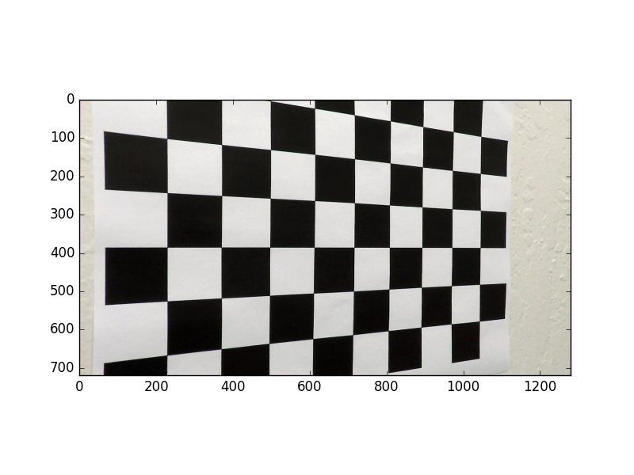
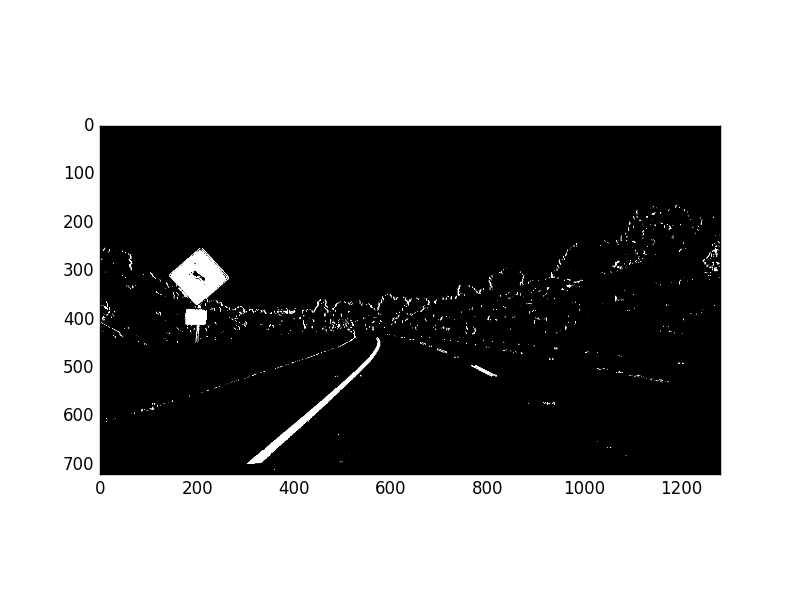

# Advanced Lane Detection

## Overview
Detect lanes using computer vision techniques. This project is part of the [Udacity Self-Driving Car Nanodegree](https://www.udacity.com/drive), and much of the code is leveraged from the lecture notes.

The following steps were performed for lane detection:

* Compute the camera calibration matrix and distortion coefficients given a set of chessboard images.
* Apply a distortion correction to raw images.
* Use color transforms, gradients, etc., to create a thresholded binary image.
* Apply a perspective transform to rectify binary image ("birds-eye view").
* Detect lane pixels and fit to find the lane boundary.
* Determine the curvature of the lane and vehicle position with respect to center.
* Warp the detected lane boundaries back onto the original image.
* Output visual display of the lane boundaries and numerical estimation of lane curvature and vehicle position.

[Here](https://youtu.be/lSd_WY1bqLw) is the final video output on Youtube. The same video is 'out.mp4' in this repo. The original video is 'project_video.mp4'.

## Dependencies
* Python 3.5
* Numpy
* OpenCV-Python
* Matplotlib
* Pickle

## How to run
Run `python line_fit_video.py`. This will take the raw video file at 'project_video.mp4', and create an annotated output video at 'out.mp4'. Afterwards, it will display an example annotated image on screen.

To run the lane detector on arbitrary video files, update the last few lines of 'line_fit_video.py'.

## Camera calibration
The camera was calibrated using the chessboard images in 'camera_cal/*.jpg'. The following steps were performed for each calibration image:

* Convert to grayscale
* Find chessboard corners with OpenCV's `findChessboardCorners()` function, assuming a 9x6 board

After the above steps were executed for all calibration images, I used OpenCV's `calibrateCamera()` function to calculate the distortion matrices. Using the distortion matrices, I undistort images using OpenCV's `undistort()` function.

To illustrate, the following is the calibration image 'camera_cal/calibration5.jpg':

Here is the same image undistored via camera calibration:

The final calibration matrices are saved in the pickle file 'calibrate_camera.p'

## Lane detection pipeline
The following describes and illustrates the steps involved in the lane detection pipeline. For illustration, below is the original image we will use as an example:

### Undistort image
Using the camera calibration matrices in 'calibrate_camera.p', I undistort the input image. Below is the example image above, undistorted:

The code to perform camera calibration is in 'calibrate_camera.py'. For all images in 'test_images/\*.jpg', the undistorted version of that image is saved in 'output_images/undistort_\*.png'.

### Thresholded binary image
The next step is to create a thresholded binary image, taking the undistorted image as input. The goal is to identify pixels that are likely to be part of the lane lines. In particular, I perform the following:

* Apply the following filters with thresholding, to create separate "binary images" corresponding to each individual filter
  * Absolute horizontal Sobel operator on the image
  * Sobel operator in both horizontal and vertical directions and calculate its magnitude
  * Sobel operator to calculate the direction of the gradient
  * Convert the image from RGB space to HLS space, and threshold the S channel
* Combine the above binary images to create the final binary image

Here is the example image, transformed into a binary image by combining the above thresholded binary filters:

The code to generate the thresholded binary image is in 'combined_thresh.py', in particular the function `combined_thresh()`. For all images in 'test_images/\*.jpg', the thresholded binary version of that image is saved in 'output_images/binary_\*.png'.

### Perspective transform
Given the thresholded binary image, the next step is to perform a perspective transform. The goal is to transform the image such that we get a "bird's eye view" of the lane, which enables us to fit a curved line to the lane lines (e.g. polynomial fit). Another thing this accomplishes is to "crop" an area of the original image that is most likely to have the lane line pixels.

To accomplish the perspective transform, I use OpenCV's `getPerspectiveTransform()` and `warpPerspective()` functions. I hard-code the source and destination points for the perspective transform. The source and destination points were visually determined by manual inspection, although an important enhancement would be to algorithmically determine these points.

Here is the example image, after applying perspective transform:

The code to perform perspective transform is in 'perspective_transform.py', in particular the function `perspective_transform()`. For all images in 'test_images/\*.jpg', the warped version of that image (i.e. post-perspective-transform) is saved in 'output_images/warped_\*.png'.

### Polynomial fit
Given the warped binary image from the previous step, I now fit a 2nd order polynomial to both left and right lane lines. In particular, I perform the following:

* Calculate a histogram of the bottom half of the image
* Partition the image into 9 horizontal slices
* Starting from the bottom slice, enclose a 200 pixel wide window around the left peak and right peak of the histogram (split the histogram in half vertically)
* Go up the horizontal window slices to find pixels that are likely to be part of the left and right lanes, recentering the sliding windows opportunistically
* Given 2 groups of pixels (left and right lane line candidate pixels), fit a 2nd order polynomial to each group, which represents the estimated left and right lane lines

The code to perform the above is in the `line_fit()` function of 'line_fit.py'.

Since our goal is to find lane lines from a video stream, we can take advantage of the temporal correlation between video frames.

Given the polynomial fit calculated from the previous video frame, one performance enhancement I implemented is to search +/- 100 pixels horizontally from the previously predicted lane lines. Then we simply perform a 2nd order polynomial fit to those pixels found from our quick search. In case we don't find enough pixels, we can return an error (e.g. `return None`), and the function's caller would ignore the current frame (i.e. keep the lane lines the same) and be sure to perform a full search on the next frame. Overall, this will improve the speed of the lane detector, useful if we were to use this detector in a production self-driving car. The code to perform an abbreviated search is in the `tune_fit()` function of 'line_fit.py'.

Another enhancement to exploit the temporal correlation is to smooth-out the polynomial fit parameters. The benefit to doing so would be to make the detector more robust to noisy input. I used a simple moving average of the polynomial coefficients (3 values per lane line) for the most recent 5 video frames. The code to perform this smoothing is in the function `add_fit()` of the class `Line` in the file 'Line.py'. The `Line` class was used as a helper for this smoothing function specifically, and `Line` instances are global objects in 'line_fit.py'.

Below is an illustration of the output of the polynomial fit, for our original example image. For all images in 'test_images/\*.jpg', the polynomial-fit-annotated version of that image is saved in 'output_images/polyfit_\*.png'.

### Radius of curvature
Given the polynomial fit for the left and right lane lines, I calculated the radius of curvature for each line according to formulas presented [here](http://www.intmath.com/applications-differentiation/8-radius-curvature.php). I also converted the distance units from pixels to meters, assuming 30 meters per 720 pixels in the vertical direction, and 3.7 meters per 700 pixels in the horizontal direction.

Finally, I averaged the radius of curvature for the left and right lane lines, and reported this value in the final video's annotation.

The code to calculate the radius of curvature is in the function `calc_curve()` in 'line_fit.py'.

### Vehicle offset from lane center
Given the polynomial fit for the left and right lane lines, I calculated the vehicle's offset from the lane center. The vehicle's offset from the center is annotated in the final video. I made the same assumptions as before when converting from pixels to meters.

To calculate the vehicle's offset from the center of the lane line, I assumed the vehicle's center is the center of the image. I calculated the lane's center as the mean x value of the bottom x value of the left lane line, and bottom x value of the right lane line. The offset is simply the vehicle's center x value (i.e. center x value of the image) minus the lane's center x value.

The code to calculate the vehicle's lane offset is in the function `calc_vehicle_offset()` in 'line_fit.py'.

### Annotate original image with lane area
Given all the above, we can annotate the original image with the lane area, and information about the lane curvature and vehicle offset. Below are the steps to do so:

* Create a blank image, and draw our polyfit lines (estimated left and right lane lines)
* Fill the area between the lines (with green color)
* Use the inverse warp matrix calculated from the perspective transform, to "unwarp" the above such that it is aligned with the original image's perspective
* Overlay the above annotation on the original image
* Add text to the original image to display lane curvature and vehicle offset

The code to perform the above is in the function `final_viz()` in 'line_fit.py'.

Below is the final annotated version of our original image. For all images in 'test_images/\*.jpg', the final annotated version of that image is saved in 'output_images/annotated_\*.png'.

## Discussion
This is an initial version of advanced computer-vision-based lane finding. There are multiple scenarios where this lane finder would not work. For example, the Udacity challenge video includes roads with cracks which could be mistaken as lane lines (see 'challenge_video.mp4'). Also, it is possible that other vehicles in front would trick the lane finder into thinking it was part of the lane. More work can be done to make the lane detector more robust, e.g. [deep-learning-based semantic segmentation](https://arxiv.org/pdf/1605.06211.pdf) to find pixels that are likely to be lane markers (then performing polyfit on only those pixels).
